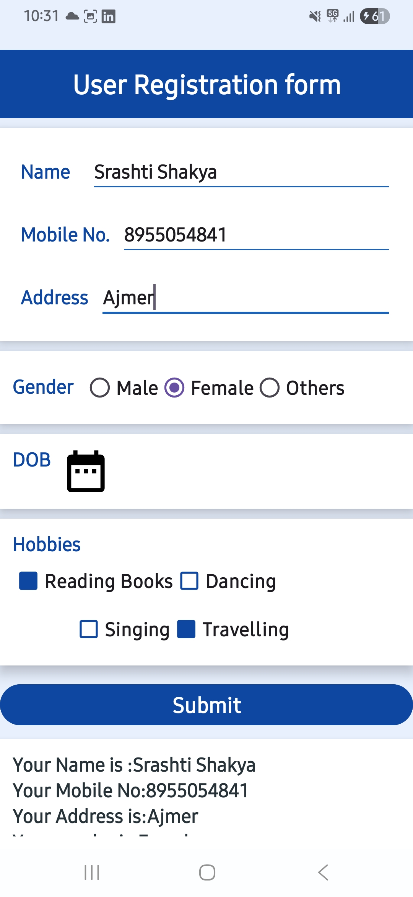

# 🧾 User Registration Form (Android Activity)

A simple Android application that demonstrates a User Registration Form using Java and XML in Android Studio.

---

## ✨ Features

- Clean and simple UI design  
- Basic form structure using XML layouts  
- Button click handling  

---

## 🖼️ Output Screenshots

## 👩‍💻 Submitted by

**Rashi bhojwani**  
BCA 2nd Year
